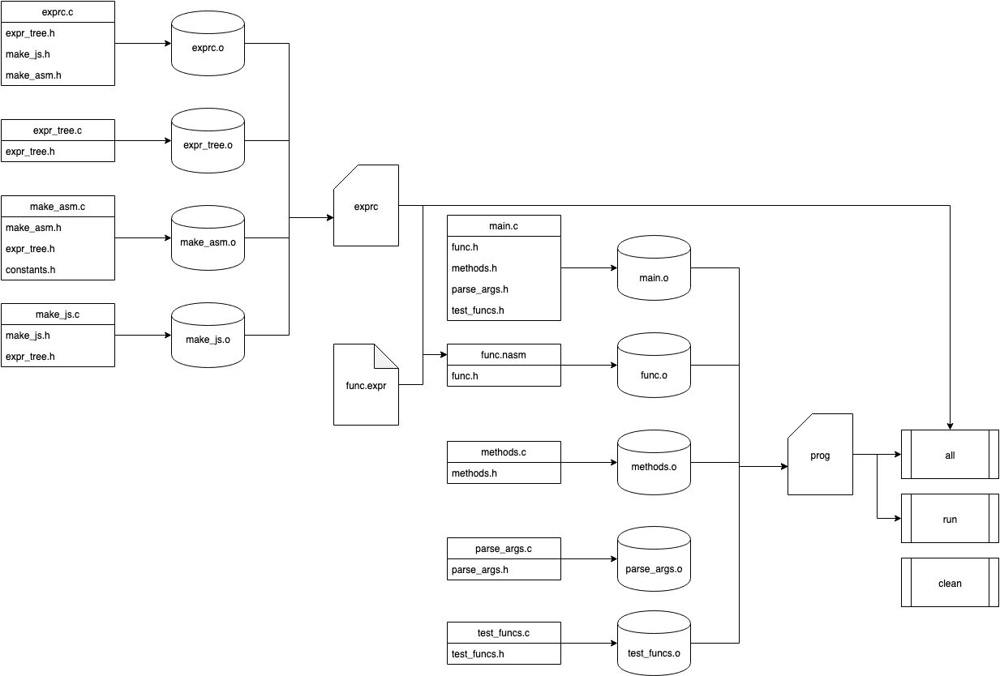

# Area

## Usage
Download:
```bash
$ git clone https://github.com/mishapankin/Area
$ cd ./Area
```

Build:
```bash
$ make
```

Run main program:

```bash
$ make run
./bin/prog --human
Plot is in file:///home/username/Area/html/graph.html

x12: -0.000002
x23: 1.728490
x31: 1.414228

Area: 1.307068
```
or
```bash
$ bin/prog --human
Plot is in file:///home/username/Area/html/graph.html

x12: -0.000002
x23: 1.728490
x31: 1.414228

Area: 1.307068
```

Help:
```bash
$ bin/prog --help
Calculates area of a figure bounded by graphs of 3 functions.
Plot of graph is on file:///home/username/Area/html/graph.html
Arguments:
	--help, -h			Show this help
	--human				Print with explaining text.
	--iter				Print count of iterations.
	--ti NUM A B			Get value of integral NUM from A to B.
	--tr NUM1 NUM2 A B		Find x of intersection of functions NUM1 and NUM2.

Test functions are:
	f1(x) = 0
	f2(x) = x * x
	f3(x) = x + 1
	f4(x) = sin(x)
	f5(x) = 1 / x
```

Test:
```bash
$ bin/prog --ti 4 0 3.1415 --human
f4(x) = sin(x)
a: 0.000000
b: 3.141500
Integral: 2.000013
$ bin/prog --tr 4 5 0.5 2 --human --iter
f4(x) = sin(x)
f5(x) = 1 / x
a: 0.500000
b: 2.000000
Iterations: 37
Root: 1.114152
```

## Project structure

